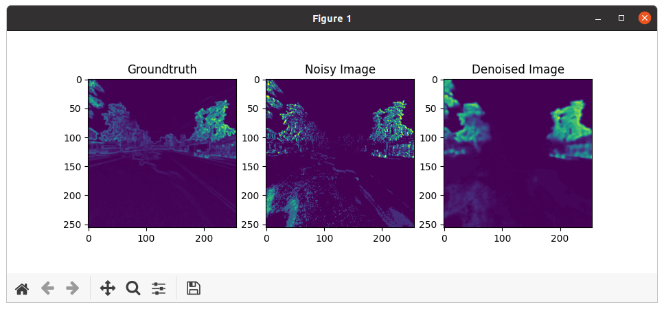

## EventVLAD (IROS 2021)

This repo contains codebase for our paper presented in IROS 2021 [[pdf](https://ieeexplore.ieee.org/document/9635907)],

"EventVLAD: Visual place recognition with reconstructed edges from event cameras".

### Pretrained weights

- Denoiser
  
We provide pretrained weights and a minimal example for event-based denoiser used in our module. You may use the processed outputs from our event denoiser to other VPR pipelines such as [NetVLAD](https://github.com/Nanne/pytorch-NetVlad).

(carla-pretrained)
https://drive.google.com/file/d/1D1tHHSRd-2iVfD4GuEz0jHDlh7evkzf6/view?usp=sharing

(brisbane-pretrained)
https://drive.google.com/file/d/1xdoGI7vmNelaR_D9-FUk5SbB3webqa5c/view?usp=sharing

- Encoder

The pretrained VGG16 encoder weight for event-based place recognition can be downloaded from:

https://drive.google.com/file/d/1rSIhH1pk8ADxfqYQXoos_hTuWyfiWSu3/view?usp=sharing


### Run your example

- Event denoiser
  
```python denoise_sample.py```


  Running the above sample requires a consequent three event-generated frame images (in our sample case, we provided event-image consisted with events during 1.6ms for each frames). The samples are located under 'samples' folder.

  As a result, you will see the groundtruth (generated from ideal camera in simulation), noisy events from simple accumulation, and the results of denoising module, respectively.



### bibtex:

```
@inproceedings{lee2021eventvlad,
  title={EventVLAD: Visual place recognition with reconstructed edges from event cameras},
  author={Lee, Alex Junho and Kim, Ayoung},
  booktitle={2021 IEEE/RSJ International Conference on Intelligent Robots and Systems (IROS)},
  pages={2247--2252},
  year={2021},
  organization={IEEE}
}
```
